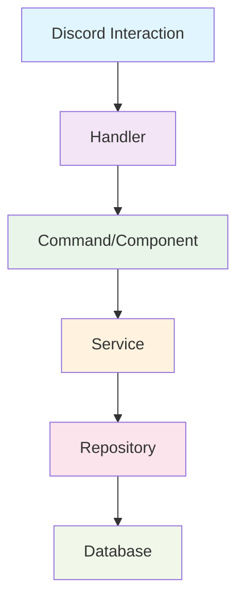

# Arquitetura do Bot Horácio 🎭

Este documento descreve a arquitetura e os padrões de design utilizados no bot Horácio, um bot de RPG para Discord construído com TypeScript, Discord.js v14+, Prisma e Supabase.

## 📋 Índice

- [Visão Geral](#visão-geral)
- [Princípios Arquiteturais](#princípios-arquiteturais)
- [Estrutura de Camadas](#estrutura-de-camadas)
- [Fluxo de Dados](#fluxo-de-dados)
- [Estrutura de Pastas](#estrutura-de-pastas)
- [Padrões de Design](#padrões-de-design)
- [Sistema de Injeção de Dependência](#sistema-de-injeção-de-dependência)
- [Tratamento de Erros](#tratamento-de-erros)
- [Sistema de Conteúdo](#sistema-de-conteúdo)

## 🏗️ Visão Geral

O bot Horácio segue os princípios da **Arquitetura Limpa (Clean Architecture)** de Robert C. Martin, garantindo:

- **Separação de Responsabilidades**: Cada camada tem uma responsabilidade específica
- **Desacoplamento**: As camadas não dependem de detalhes de implementação
- **Testabilidade**: Código facilmente testável através de mocks e stubs
- **Manutenibilidade**: Estrutura clara e previsível
- **Escalabilidade**: Fácil adição de novos módulos e funcionalidades

## 🎯 Princípios Arquiteturais

### 1. Arquitetura Limpa
- **Regra de Dependência**: Dependências apontam sempre para dentro (das camadas externas para as internas)
- **Inversão de Dependência**: Abstrações não dependem de detalhes, detalhes dependem de abstrações
- **Responsabilidade Única**: Cada classe/módulo tem uma única razão para mudar

### 2. SOLID
- **S**ingle Responsibility Principle
- **O**pen/Closed Principle
- **L**iskov Substitution Principle
- **I**nterface Segregation Principle
- **D**ependency Inversion Principle

### 3. DRY (Don't Repeat Yourself)
- Reutilização de código através de abstrações
- Sistema de conteúdo centralizado
- Componentes reutilizáveis

## 🏛️ Estrutura de Camadas



### 1. **Handlers** (Camada de Apresentação)
- **Responsabilidade**: Receber e rotear interações do Discord
- **Localização**: `src/core/handlers/`
- **Características**:
  - Conhece a API do Discord.js
  - Não contém lógica de negócio
  - Delega para comandos/componentes específicos
  - Trata erros de forma centralizada

### 2. **Commands/Components** (Camada de Interface)
- **Responsabilidade**: Processar comandos e componentes específicos
- **Localização**: `src/modules/*/commands/`
- **Características**:
  - Conhece Discord.js para formatação de respostas
  - Valida entrada do usuário
  - Chama serviços apropriados
  - Formata saída para o Discord

### 3. **Services** (Camada de Aplicação/Negócio)
- **Responsabilidade**: Lógica de negócio pura
- **Localização**: `src/modules/*/services/`
- **Características**:
  - **NÃO conhece Discord.js nem Prisma**
  - Contém regras de negócio
  - Orquestra operações complexas
  - Valida dados de negócio

### 4. **Repositories** (Camada de Acesso a Dados)
- **Responsabilidade**: Abstração do acesso a dados
- **Localização**: `src/modules/*/repositories/`
- **Características**:
  - **ÚNICA camada que conhece Prisma**
  - Implementa interfaces definidas
  - Operações CRUD puras
  - Não contém lógica de negócio

### 5. **Database** (Camada de Infraestrutura)
- **Responsabilidade**: Persistência de dados
- **Tecnologia**: PostgreSQL via Supabase
- **ORM**: Prisma

## 🔄 Fluxo de Dados

### Fluxo de Comando Típico

```typescript
// 1. Usuário executa /ficha
Discord Interaction
    ↓
// 2. Handler roteia para comando
InteractionHandler.handle()
    ↓
// 3. Comando processa entrada
ViewCharacterCommand.execute()
    ↓
// 4. Serviço aplica regras de negócio
CharacterService.getCharacterDetails()
    ↓
// 5. Repositório acessa dados
CharacterRepository.findByIdWithUser()
    ↓
// 6. Prisma consulta banco
PrismaClient.character.findUnique()
    ↓
// 7. Dados retornam pela mesma cadeia
Database → Repository → Service → Command → Handler → Discord
```

## 📁 Estrutura de Pastas

```
src/
├── core/                    # Lógica central do bot
│   ├── container/          # Container de injeção de dependência
│   ├── content/            # Sistema de conteúdo (mensagens)
│   ├── errors/             # Classes de erro customizadas
│   └── handlers/           # Handlers principais de interação
├── modules/                # Módulos de negócio
│   ├── character/          # Sistema de personagens
│   │   ├── commands/       # Comandos relacionados a personagens
│   │   ├── repositories/   # Acesso a dados de personagens
│   │   └── services/       # Lógica de negócio de personagens
│   └── dice-roller/        # Sistema de rolagem de dados
│       ├── commands/       # Comandos de rolagem
│       └── services/       # Lógica de rolagem
└── main.ts                 # Ponto de entrada principal
```

### Convenções de Nomenclatura

- **Interfaces**: Prefixo `I` (ex: `ICharacterRepository`)
- **Implementações**: Nome descritivo (ex: `CharacterRepository`)
- **Serviços**: Sufixo `Service` (ex: `CharacterService`)
- **Comandos**: Sufixo `Command` (ex: `ViewCharacterCommand`)
- **Erros**: Sufixo `Error` (ex: `CharacterNotFoundError`)

## 🎨 Padrões de Design

### 1. Repository Pattern
```typescript
// Interface define o contrato
interface ICharacterRepository {
  findById(id: string): Promise<Character | null>;
}

// Implementação usa Prisma
class CharacterRepository implements ICharacterRepository {
  async findById(id: string): Promise<Character | null> {
    return this.prisma.character.findUnique({ where: { id } });
  }
}
```

### 2. Dependency Injection
```typescript
@singleton()
class CharacterService {
  constructor(
    @inject('CharacterRepository') 
    private repository: ICharacterRepository
  ) {}
}
```

### 3. Strategy Pattern
```typescript
// Handler usa strategy para diferentes tipos de interação
class InteractionHandler {
  async handle(interaction: Interaction) {
    switch (interaction.type) {
      case InteractionType.ApplicationCommand:
        return this.handleSlashCommand(interaction);
      case InteractionType.MessageComponent:
        return this.handleComponent(interaction);
    }
  }
}
```

### 4. Factory Pattern
```typescript
// Container atua como factory para dependências
const service = container.resolve(CharacterService);
```

## 💉 Sistema de Injeção de Dependência

Utilizamos **tsyringe** para gerenciar dependências:

### Configuração
```typescript
// src/core/container/index.ts
container.register<ICharacterRepository>('CharacterRepository', {
  useClass: CharacterRepository,
});
```

### Uso em Serviços
```typescript
@singleton()
export class CharacterService {
  constructor(
    @inject('CharacterRepository')
    private readonly characterRepository: ICharacterRepository
  ) {}
}
```

### Benefícios
- **Testabilidade**: Fácil mock de dependências
- **Flexibilidade**: Troca de implementações sem alterar código
- **Desacoplamento**: Serviços não conhecem implementações concretas

## 🚨 Tratamento de Erros

### Hierarquia de Erros
```typescript
AppError (base)
├── ValidationError
├── NotFoundError
│   └── CharacterNotFoundError
├── PermissionDeniedError
└── BusinessLogicError
```

### Fluxo de Tratamento
1. **Serviços** lançam erros específicos
2. **Commands** capturam e formatam
3. **Handler** trata erros não capturados
4. **Sistema de Conteúdo** fornece mensagens amigáveis

## 📝 Sistema de Conteúdo

### Centralização de Mensagens
```typescript
// src/core/content/messages.ts
export const messages = {
  'character.not_found': '🎭 Personagem não encontrado na taverna...',
  'character.created': '🎵 {{name}} está pronto para aventuras!',
};
```

### Uso com Interpolação
```typescript
const message = getMessage('character.created', { name: 'Aragorn' });
// Resultado: "🎵 Aragorn está pronto para aventuras!"
```

### Benefícios
- **Consistência**: Todas as mensagens seguem a personalidade do Bardo
- **Manutenibilidade**: Mudanças centralizadas
- **Internacionalização**: Base para múltiplos idiomas

## 🔧 Configuração de Desenvolvimento

### Hot Module Replacement (HMR)
- **Vite** com `vite-plugin-node`
- Recarregamento automático durante desenvolvimento
- Preservação de estado quando possível

### Qualidade de Código
- **ESLint**: Análise estática
- **Prettier**: Formatação consistente
- **TypeScript**: Tipagem estática
- **TSDoc**: Documentação obrigatória

## 🧪 Testabilidade

### Estratégia de Testes
- **Testes Unitários**: Serviços e utilitários
- **Testes de Integração**: Repositórios com banco
- **Mocks**: Dependências externas

### Exemplo de Teste
```typescript
describe('CharacterService', () => {
  it('should create character with valid data', async () => {
    const mockRepo = mock<ICharacterRepository>();
    const service = new CharacterService(mockRepo);
    
    const result = await service.createCharacter(validData);
    
    expect(result.success).toBe(true);
  });
});
```

## 📈 Escalabilidade

### Adição de Novos Módulos
1. Criar pasta em `src/modules/`
2. Implementar camadas (repository, service, commands)
3. Registrar no container
4. Adicionar rotas no handler

### Padrões para Crescimento
- **Modularização**: Cada funcionalidade em módulo separado
- **Interfaces**: Contratos bem definidos
- **Configuração**: Externalizável via ambiente
- **Logging**: Observabilidade completa

---

Esta arquitetura garante que o bot Horácio seja robusto, manutenível e pronto para crescer com novas funcionalidades mantendo a qualidade e a personalidade carismática do Bardo! 🎭✨
